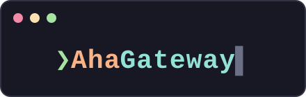

<div align="center">



**A FastAPI gateway + model manager for a local [vLLM](https://github.com/vllm-project/vllm) server.**

multi-model registry · request-driven model switching · SSE streaming · thinking separated from answers

[](https://www.python.org/)
[](https://fastapi.tiangolo.com/)
[](LICENSE)
[]()

[API](#api) · [Architecture](#architecture) · [Getting started](#getting-started) · [Design notes](#design-notes)

</div>

---

> ⚠️ **Alpha.** AhaGateway is under active development — expect rough edges and
> breaking changes between versions.

vLLM cannot swap models at runtime, and a loaded model owns most of the GPU.
AhaGateway turns that constraint into an API: register several models, name one
in a chat request, and the infrastructure swaps Docker containers for you —
stopping the current model, creating the target from a declarative spec if
needed, and holding the request until the new model is ready. Responses come
back in a clean, minimal schema with the model's reasoning (`thinking`)
already separated from the final answer.

Companion project: [AhaCode](https://github.com/chycs7747/AhaCode), a
terminal chat client that can talk to this gateway (or any OpenAI-compatible
endpoint).

## API

The gateway (`:9000`) is the single public door:

| Method | Path | Effect |
|---|---|---|
| `GET` | `/health` | Gateway liveness |
| `GET` | `/models` | Registered models with `status` / `active` / `ready` |
| `POST` | `/model/load` | Warm a model up (returns immediately; poll `/models`) |
| `POST` | `/model/unload` | Stop the active model, free the GPU |
| `POST` | `/chat` | Relay a conversation to vLLM |
| `POST` | `/chat/stream` | Same, but streamed as SSE events |

`POST /chat` takes a deliberately small request — not the full OpenAI surface.
Name a model and the gateway switches to it first (the request just takes
longer); omit it to use whatever is running:

```json
{
  "model": "your-model",
  "messages": [{"role": "user", "content": "What is 2^10?"}],
  "temperature": 0.6,
  "max_tokens": 1024,
  "enable_thinking": true
}
```

and answers with thinking and token usage split out:

```json
{
  "content": "2^10 is 1024.",
  "thinking": "The user asks for 2 to the power of 10...",
  "finish_reason": "stop",
  "usage": {"prompt_tokens": 70, "completion_tokens": 59, "total_tokens": 129}
}
```

`POST /chat/stream` emits the same content as SSE, with thinking and answer
deltas distinguished by `kind`:

```
data: {"kind": "thinking", "delta": "The user asks..."}

data: {"kind": "content", "delta": "2^10 is "}

data: {"kind": "end", "finish_reason": "stop"}

data: [DONE]
```

Interactive docs live at `/docs` on both services.

## Architecture

Two services, split along the privilege boundary:

```
[clients] ──> gateway :9000 (public)          manager :9100 (internal)
              /chat, /chat/stream ── sessions ──> /sessions        │ docker socket
              /models, /model/*   ── proxied ───> /models, /model/*│ (root-equivalent,
              │                                                    │  isolated here)
              └── inference goes straight to vLLM :8078 <── create/start/stop
```

- **gateway** — stateless data plane: validates, relays chat, proxies admin
  calls. Never touches Docker.
- **manager** — control plane: owns the model registry, creates/starts/stops
  vLLM containers, enforces GPU exclusivity. Lives on the GPU machine.
- Inference bytes flow directly between the gateway and vLLM; the manager only
  hands out *sessions* — leases that say which model to use and where.

```
gateway/                              manager/
├── main.py                           ├── main.py
├── config.py      (git-ignored)      ├── config.py      (git-ignored)
├── config.example.py                 ├── config.example.py
├── schemas.py                        ├── schemas.py
├── manager_client.py                 ├── vllm_manager.py   # docker SDK, registry,
└── routers/                          │                     # sessions, drain
    ├── chat.py                       └── routers/
    └── model.py   # proxy                └── model.py      # admin + session API
```

## Requirements

- Python 3.12+
- Docker with GPU support, and model weights on local disk
- Both `config.py` files filled in (copied from the `.example` templates)

## Getting started

```bash
git clone https://github.com/chycs7747/AhaGateway && cd AhaGateway
python3 -m venv .venv && source .venv/bin/activate
pip install -r requirements.txt
cp manager/config.example.py manager/config.py   # registry: your models, image, paths
cp gateway/config.example.py gateway/config.py   # manager address, timeouts

# terminal 1 — on the GPU machine
fastapi dev manager/main.py --port 9100
# terminal 2 — anywhere that can reach the manager
fastapi dev gateway/main.py --port 9000
```

Or run both as containers (host networking; the manager gets the Docker
socket so it can start/stop vLLM containers; survives reboots):

```bash
docker compose up -d --build
```

Both `config.py` files are git-ignored — your endpoints, container names, and
model paths stay on your machine.

Then try it:

```bash
curl -s -X POST http://localhost:9000/chat \
  -H 'Content-Type: application/json' \
  -d '{"model":"your-model","messages":[{"role":"user","content":"hi"}]}'
```

## Design notes

- **A narrow schema is the point.** `/chat` exposes a handful of fields
  instead of the full OpenAI surface, so the gateway owns validation and
  policy, and the backend can change without touching clients. The
  OpenAI-format conversion happens in exactly one place (`gateway/routers/chat.py`).
- **Switching is request-driven.** Clients never call load/unload in normal
  use — naming a model in `/chat` is enough. The explicit `/model/*` endpoints
  remain as admin handles (warm-up, freeing the GPU).
- **In-flight requests are never killed by a swap.** Each inference holds a
  session; switches drain open sessions first (bounded by a drain timeout —
  the switcher gets a `503` rather than killing someone's generation).
  Sessions carry a TTL so a crashed client can't block switches forever.
- **Privilege is isolated.** Only the manager holds the Docker socket. The
  internet-facing gateway is a stateless translator that can run anywhere —
  the manager is the agent that must live on the GPU host.
- **Thinking is absorbed at the boundary.** Whether the server has a
  reasoning parser (separate `reasoning` / `reasoning_content` field) or
  leaks raw `<think>` tags into content, `split_thinking()` normalizes both
  into the same `content` / `thinking` pair. (Streaming assumes a server-side
  reasoning parser; the `<think>`-tag fallback applies to the non-streaming
  path only.)
- **Sync SDKs stay off the event loop.** The docker SDK is synchronous, so
  the manager runs it via `asyncio.to_thread`; handlers stay `async` and the
  loop keeps serving other requests while containers start and stop.
- **`running` ≠ ready.** After a load the container is up immediately, but
  vLLM spends minutes loading weights onto the GPU; `/models` reports both,
  and session acquisition waits for true readiness.

## License

[MIT](LICENSE)
